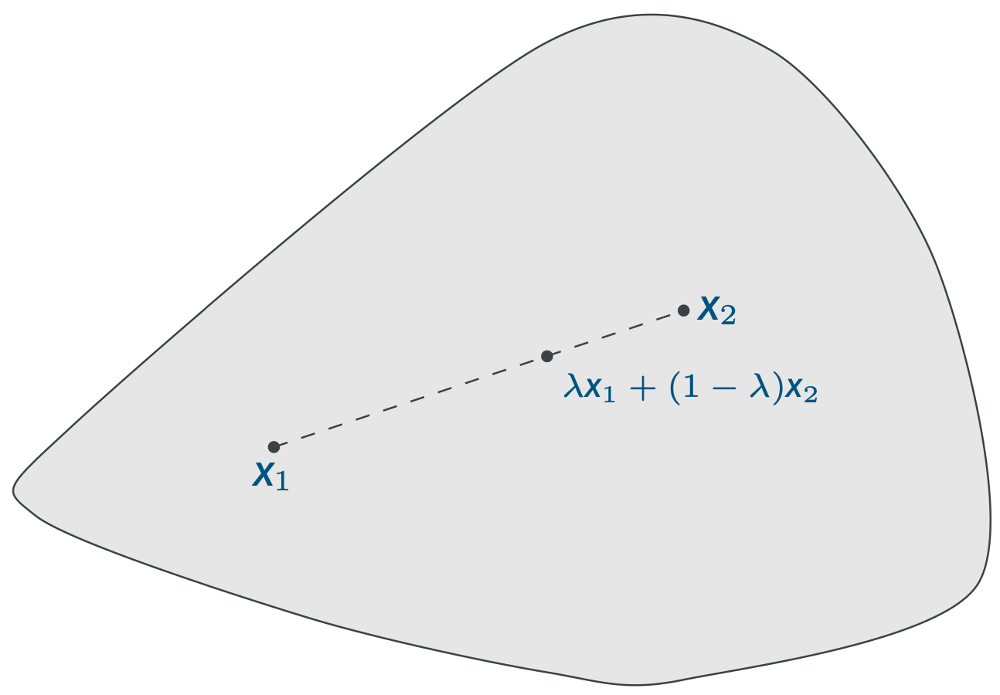
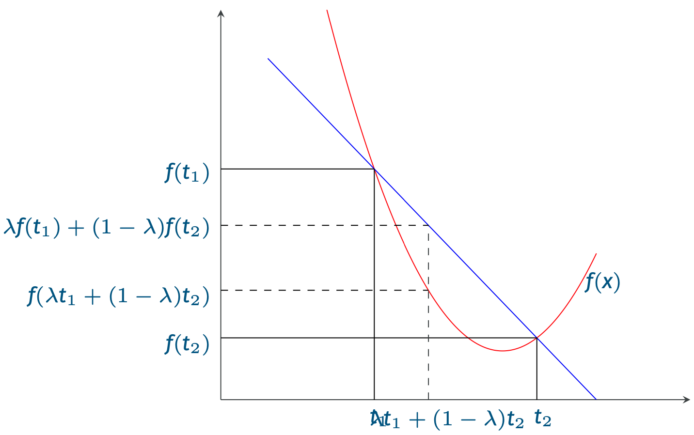

Un insieme di punti $S \subset \mathbb{R}^d$ è detto **convesso** se presi una qualsiasi coppia di punti $x_1,x_2 \in S$ riusciamo a tracciare un segmente tra $x_1$ e $x_2$ i cui punti sono ancora tutti in $S$.
Più formalmente, $\forall x_1,x_2 \in S$ e $\forall \lambda \in (0,1)$ abbiamo che $$\lambda x_1 + (1-\lambda)x_2 \in S$$

Analogamente, una funzione $f$ è **convessa** se l'insieme dei punti al di sopra della funzione è un insieme convesso.
In altri termini se $$f(\lambda x_1 + (1-\lambda)x_2) \leq \lambda f(x_1) + (1-\lambda)f(x_2)$$ ^6cb9e0

