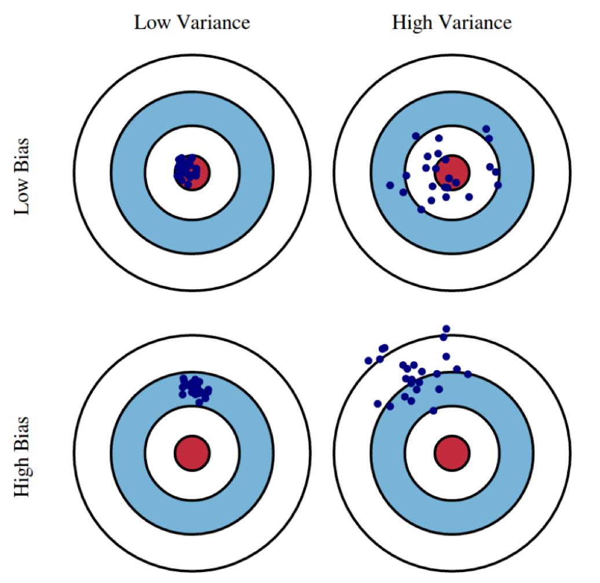
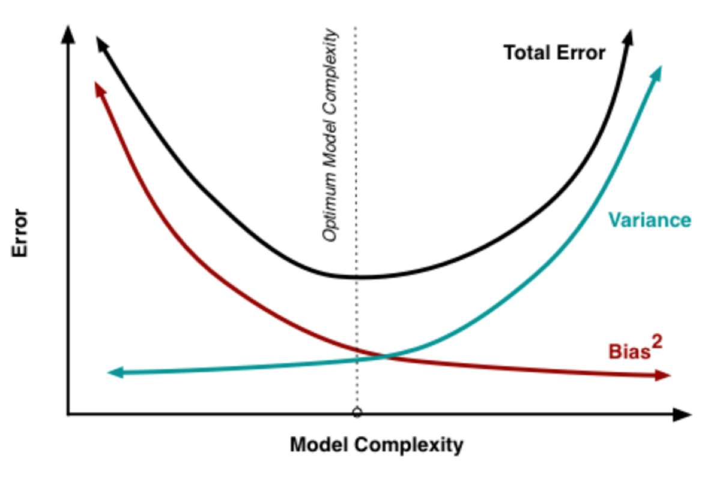

## Bias vs Varianza
In generale, il [[Prediction Risk#^04c36e|rischio]] di un [[Prediction Risk|predittore ottimo]] $h^*$ (che minimizza il ==**rischio empirico**==) può essere decomposto in due parti $$\mathcal{R}(h^*) = \varepsilon_B + \varepsilon_V$$ dove:
- $\varepsilon_B$ è il **minimo rischio** che un qualsiasi $h \in \mathcal{H}$ può avere. Questo valore dipende solamente dalla conformazione di $\mathcal{H}$, ed è **indipendente** dal training set. Questa quantità è detta **bias**.
- $\varepsilon_V$ misura la sensibilità del modello alle fluttuazioni casuali dei dati del training set. Questo è correlato al fatto che il rischio empirico (che $h^*$ minimizza) dipende dai dati del training set, mentre il rischio è definito su tutto $\mathcal{X}$. Questa quantità è detta **varianza**.

La scelta di $\mathcal{H}$ è soggetta al **tradeoff bias-varianza**:
- un **alto bias** implica una **bassa varianza**. Ciò indica che tutti i predittori ottimi di $\mathcal{H}$ che si possono ottenere da differenti training set hanno tutti comportamenti simili con rischi simili (bassa varianza). Purtroppo però quasi tutti questi predittori tendono a comportarsi male (basso bias), in quanto $\mathcal{H}$ è troppo semplice e poco espressivo.
- un **basso bias** e **alta varianza** implica che $\mathcal{H}$ è molto espressivo, che quindi ha un buon predittore per i dati del dataset. Purtroppo in questo caso il predittore risulta troppo buono per i dati, e si tende all'overfitting.

Dato che il bias decresce al crescere della varianza, e viceversa, allora avremo che il rischio di un predittore $h^*$ che minimizza il rischio empirico è il **punto di minimo** della parabola `bias + varinza`.

