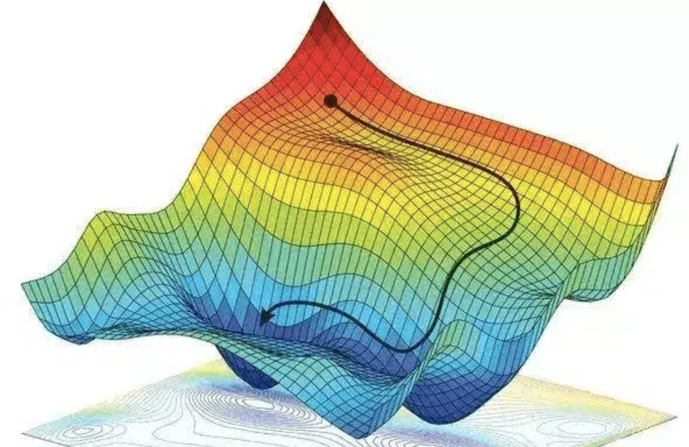
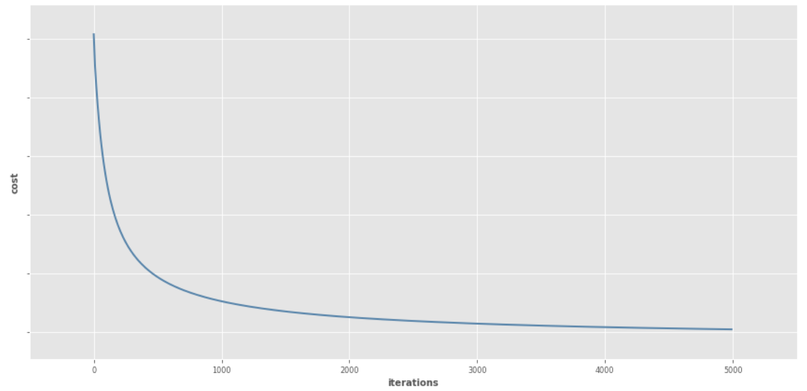

Richiamando [[Prediction Risk|quanto già visto]], la **funzione loss** $L: \mathcal{Y} \times \mathcal{Y} \to \mathbb{R}$ misura, per ogni $y,t \in \mathcal{Y}$, qual è il costo di predire il valore $y$ anziché quello ottimale $t$.
Nel [[Supervised Learning]], questa quantità serve per misurare qualità di un predittore $h$ rispetto a un input $x$ con target $t$.
$$\mathcal{R}(h,x) = L(h(x),t)$$

Questa misura viene usata a sua volta per calcolare il [[Prediction Risk#^9cd1a0|rischio empirico]], ovvero una misura di qualità di un predittore $h$ rispetto al training set $\mathcal{T}$.
$$\overline{\mathcal{R}}_{\mathcal{T}}(h) = \frac{1}{\vert \mathcal{T} \vert} \sum_{(x,t) \in \mathcal{T}}L(h(x),t)$$

Durante la fase di training si cerca di trovare la funzione $h$ che minimizza il rischio empirico.
Più in generale, assumiamo che la famiglia $\mathcal{H}$ di funzioni sia composta da funzioni che dipendono da una serie di parametri $\pmb{\theta} = (\theta_1, ..., \theta_d)$ .
Perchio $h_{\theta}$ è la funzione di $\mathcal{H}$ con parametri $\theta$.

Perciò, riscrivendo tutto in funzione di $\theta$, avremo $$\vert \mathcal{T} \vert \cdot \overline{\mathcal{R}}_{\mathcal{T}}(\pmb{\theta}) =\mathcal{L}(\pmb{\theta}; \mathcal{T}) = \sum_{i=1}^{n}L_i(\pmb{\theta})$$ dove $$L_i(\pmb{\theta}) = L(h_{\pmb{\theta}}(x_i), t_i)$$

```ad-important
title: Info
Minimizzare $\mathcal{L}( \;\cdot\; ; \mathcal{T})$ equivale a minimizzare $\overline{\mathcal{R}}_{\mathcal{T}}( \;\cdot\; )$, in quanto sono **proporzionali**.
$$\vert \mathcal{T} \vert \cdot \overline{\mathcal{R}}_{\mathcal{T}}(\pmb{\theta}) =\mathcal{L}(\pmb{\theta}; \mathcal{T})$$
```

Ci siamo quindi ridotti ad uno **spazio dei parametri** $\Theta \subseteq \mathbb{R}^d$, e vogliamo trovare il punto di **minimo globale** rispetto alla funzione $\mathcal{L}( \;\cdot\; ; \mathcal{T})$.

Un primo approccio potrebbe quello **analitico**, trovando il punto in cui la **derivata si annulla** (e in cui derivata seconda è positiva).
$$\nabla_{\pmb{\theta}} \;\mathcal{L}( \pmb{\theta} ; \mathcal{T}) = \mathbf{0}$$
$$\dfrac{\partial}{\partial \theta_i} \mathcal{L}( \pmb{\theta} ; \mathcal{T}) = 0; \;\;\; \forall i = 1,...,d$$

I problemi di questo approccio però sono:
1. bisogna vedere la derivata seconda per distinguere punti minimo, massimo o sella.
2. un minimo locale potrebbe non essere molto buono rispetto a quello globale.

Un approccio più ragionevole è quello **numerico**, ovvero tramite un metodo **iterativo** noto come **Gradient Descent**.

Si parte da un punto iniziale $$\pmb{\theta}^{(0)} = (\theta_1^{(0)}, ..., \theta_d^{(0)})$$

Iterativamente, deriviamo il punto $\pmb{\theta}^{(k)}$ modificando il precedente punto $\pmb{\theta}^{(k-1)}$, modificandolo nella direzione in cui $\mathcal{L}( \;\cdot\; ; \mathcal{T})$ diminuisce.

Ovvero $$\theta^{(k)}_i = \theta^{(k-1)}_i - \eta \dfrac{\partial}{\partial \theta_i^{(k-1)}} \mathcal{L}( \pmb{\theta}^{(k-1)} ; \mathcal{T}) = \theta^{(k-1)}_i - \frac{\eta}{\vert T \vert} \sum_{(x,t) \in \mathcal{T}} \dfrac{\partial}{\partial \theta_i^{(k-1)}} L( h_{\pmb{\theta}^{(k-1)}}(x) , t)$$
O in termini vettoriali $$\pmb{\theta}^{(k)} = \pmb{\theta}^{(k-1)} - \eta \nabla_{\pmb{\theta}^{(k-1)}}\mathcal{L}( \pmb{\theta}^{(k-1)} ; \mathcal{T}) = \pmb{\theta}^{(k-1)} - \frac{\eta}{\vert T \vert} \sum_{(x,t) \in \mathcal{T}} \nabla_{\pmb{\theta}^{(k-1)}} L( h_{\pmb{\theta}^{(k-1)}}(x), t)$$
Dove $\eta$ è un **parametro di tutning**, che indica quanto deve essere ampio ogni passo.




Quello che si vuole è definire delle funzioni loss tali che:
1. abbiano un solo punto di minimo.
2. non abbiamo *punti di sella* in cui il metodo può bloccarsi.
3. sia fatta in modo tale che il metodo iterativo converga velocemente.

Segliere una funzione loss $\mathcal{L}$ che sia [[Convessità|convessa]] risolve molti problemi, in qunato ogni punto di minimo locale di una funzione convessa è anche un minimo **globale**.
Più precisamente, se la funzione è **strettamente convessa**, allora abbiamo un unico punto di minimo. ^f9f074

Un altro vantaggio delle [[Convessità#^6cb9e0|funzioni convesse]] è che la **combinazione lineare di funzioni convesse è ancora una funzione convessa**.

### Esempio Regressione Lineare
Nella [[Linear Regression]] abbiamo uno spazio di funzioni predditore del tipo $$h_{\mathbf{w},w_0}(x) = w_0 + \sum_{i=1}^{d} w_ix_i = w_0 + \mathbf{w}^Tx$$ dove i parametri sono i $d+1$ coefficienti della combinazione lineare.

Consideriamo come loss la [[Some Loss Functions#Quadratic Loss|Qaudratic Loss]] $$L(h_{\mathbf{w},w_0}(x),t) = (h_{\mathbf{w},w_0}(x) - t)^2 = \left(w_0 + \sum_{i=1}^{d} w_ix_i - t \right)^2$$
Si può dimostrare che le derivate parziali sono  $$\begin{align}
\dfrac{\partial}{\partial w_j} L(h_{\mathbf{w},w_0}(x),t) &= 2 x_j \cdot (w_0 + \mathbf{w}^Tx - t) &\forall j = 1, ..., d\\
\dfrac{\partial}{\partial w_0} L(h_{\mathbf{w},w_0}(x),t) &= 2 \cdot (w_0 + \mathbf{w}^Tx - t)
\end{align}$$^f0316c

$$\begin{align}
\dfrac{\partial}{\partial w_j} L(h_{\mathbf{w},w_0}(x),t)
&=\dfrac{\partial}{\partial w_j} \left(w_0 + \mathbf{w}^Tx -t \right)^2\\
&= \dfrac{\partial}{\partial w_j} \left( w_0 + \sum_{i=1}^{d}w_ix_i -t \right)^2\\
&= \dfrac{\partial}{\partial w_j} \left( f(x) -t \right)^2\\
&= \dfrac{\partial}{\partial w_j} \left[ (f(x))^2 - 2tf(x) + t^2 \right]\\
&= \dfrac{\partial}{\partial w_j} (f(x))^2 - 2t \dfrac{\partial}{\partial w_j}f(x)\\
&= \dfrac{\partial}{\partial w_j} \left[ f(x) \cdot f(x) \right] - 2t \dfrac{\partial}{\partial w_j}f(x)\\
&= \left[ \dfrac{\partial}{\partial w_j}f(x) \right] \cdot f(x) + f(x) \cdot \left[ \dfrac{\partial}{\partial w_j}f(x) \right] - 2t \dfrac{\partial}{\partial w_j}f(x)\\
&= \hat{y} \cdot f(x) + f(x) \cdot \hat{y} - 2t \hat{y}\\\\
&= 2 \hat{y} \cdot f(x) - 2t \hat{y}\\\\
&= 2 \hat{y} (f(x) - t)\\\\
&= 2 \left[ \dfrac{\partial}{\partial w_j}f(x) \right] (f(x) - t)\\
&= 2 \left( \dfrac{\partial}{\partial w_j} (w_0 + \mathbf{w}^Tx) \right)(w_0 + \mathbf{w}^Tx - t)
\end{align}$$

^4c1ed4

Dove $$\dfrac{\partial}{\partial w_j} \left( w_0 + \sum_{i=1}^{d}w_ix_i \right) := \begin{cases}
x_j &j = 1, ..., d\\
\\
1 &j = 0
\end{cases}$$
Se indichiamo con $\pmb{\theta} = (w_0, \mathbf{w})$ i parametri che caratterizzano lo spazio $\mathcal{H}$, avremo che il gradient descent sarà 
$$\begin{align}
\pmb{\theta}^{(k)}
&= \pmb{\theta}^{(k-1)} - \eta \nabla_{\pmb{\theta}^{(k-1)}}\mathcal{L}( \pmb{\theta}^{(k-1)} ; \mathcal{T})\\\\
&= \pmb{\theta}^{(k-1)} - \frac{\eta}{\vert T \vert} \sum_{(x,t) \in \mathcal{T}} \nabla_{\pmb{\theta}^{(k-1)}} L( h_{\pmb{\theta}^{(k-1)}}(x), t)\\\\
&= \pmb{\theta}^{(k-1)} - \frac{\eta}{\vert T \vert} \sum_{(x,t) \in \mathcal{T}} \nabla_{\pmb{\theta}^{(k-1)}} \left( w_0^{(k-1)} + \sum_{i=1}^{d} w_i^{(k-1)}x_u
i- t \right)^2
\end{align}$$

# Batch Gradient Descent
Il **Batch Gradient Descent** è ciò che abbiamo visto fin ora, ovvero calcolo i parametri ad ogni step sfruttando sempre **tutti** i dati presenti nel mio dataset $\mathcal{T}$.


![[./img/ML_03_11.png]]

```ad-attention
Ovviamente questa scelta di considerare l'intero dataset potrebbe essere dispendiosa per fare un singolo update, soprattutto per dataset di dimensioni eccessive e quando il numero di eterazioni è elevato.
```

# Stochastic Gradient Descent
Un altro approccio è quello di applicare il gradient descent però ogni volta campionando **u.a.r.** una coppia di elementi dal training set $(X,T) \in \mathcal{T}$.

```ad-info
$X$ e $T$ sono maiuscole perché denotano **variabili aleatorie**.
```

Perciò avremo $$\pmb{\theta}^{(k)} = \pmb{\theta}^{(k-1)} - \eta \nabla_{\pmb{\theta}^{(k-1)}} L(h_{\pmb{\theta}^{(k-1)}}(X), T)$$ o per le singole componenti $$\theta^{(k)}_i = \theta^{(k-1)}_i - \eta \dfrac{\partial}{\partial \theta^{(k-1)}_i} L(h_{\pmb{\theta}^{(k-1)}}(X), T)$$

![[ML/img/ML_03_12.png]]
![[ML/img/ML_03_13.png]]

# Mini-Batch Gradient Descent
Un altro modo invece è quello di considerare un sottoinsieme $B \subseteq \mathcal{T}$ di $m$ elementi ad ogni step.
Questo approccio è noto come **Mini-Batch Gradient Descent**.

Perciò avremo $$\pmb{\theta}^{(k)} = \pmb{\theta}^{(k-1)} - \frac{\eta}{m} \sum_{(x,t) \in B} \nabla_{\pmb{\theta}^{(k-1)}} L(h_{\pmb{\theta}^{(k-1)}}(x), t)$$ o per le singole componenti $$\theta^{(k)}_i = \theta^{(k-1)}_i - \frac{\eta}{m} \sum_{(x,t) \in B} \dfrac{\partial}{\partial \theta^{(k-1)}_i} L(h_{\pmb{\theta}^{(k-1)}}(x), t)$$

Questo approccio riesce a
1. avere una convergenza più stabile rispetto al [[#Stochastic Gradient Descent]] perché considera un campione più ampio.
2. riduce le risorse in quanto non considera l'intero dataset.

```ad-note
Osservare che:
- quando $\vert B \vert = 1$ allora stiamo nel caso del [[#Stochastic Gradient Descent]].
- quando $\vert B \vert = \vert \mathcal{T} \vert$ allora stiamo nel caso del [[#Batch Gradient Descent]].
```

![[ML/img/ML_03_14.png]]
![[ML/img/ML_03_15.png]]

```ad-warning
title: Problemi aperti
Scegliere un buon *learning rate* $\eta$ risulta essere un problema difficile.
Perciò si potrebbero applicare dei meccanismi per **regolare il learning rate** durante l'addestramento, riducendolo secondo un metodo predefinito o quando la funzione di *loss* scende al di sotto di una soglia.
```


# Momentum Gradient Descent
Questo metodo si ispira ad una **interpretazione fisica** del processo di ottimizzazione.
Supponiamo di avere un corpo di **massa** $m = 1$, il quale si **muove** sulla superficie definita da una **funzione costo** $J(\theta)$.
Tale corpo ha
- **energia potenziale** al punto $\theta$ pari a $$U(\theta) = \eta J(\theta)$$
- **forza peso** al punto $\theta$ pari a $$F(\theta) = m \cdot\vec{a} = -\nabla U(\theta) = - \eta J'(\theta)$$

Nel gradient descent classico il movimento è determinato solamente dall'**accelerazione** in un punto $\theta$, il quale è pari al gradiente $J'(\theta)$.

Nel **momentum gradient descent** viene considerata anche una **velocità** $v(\theta)$ del nostro corpo nel punto $\theta$.
Perciò la posizione del nostro corpo può essere definita come 
$$\theta^{(k+1)} = \theta^{(k)} + \gamma v^{(k+1)}$$ dove
$$v^{(k+1)} = v^{(k)} - \eta J'(\theta) \bigg\vert_{\theta = \theta^{(k)}}$$
In pratica si applica la discesa del gradiente alla velocità, la quale a sua volta va ad influire sulla posizione.

![[ML/img/ML_03_18.png]]

![[ML/img/ML_03_19.png]]

![[ML/img/ML_03_20.png]]

# Nesterov Gradient Descent
In termini di [[#Momentum Gradient Descent]], possiamo esprimere il gradiente descent classico come
$$\tilde{\theta}^{(k+1)} = \theta^{(k)} + \gamma v^{(k)}$$
Nel **MGD** invece si aggiurno $v^{(k)}$ in $v^{(k+1)}$ ottenendo il nuovo punto
$$\theta^{(k+1)} = \theta^{(k)} + \gamma v^{(k+1)}$$

L'idea del **Nesterov Gradient Descent** è quella di mantenere una **quantità di moto**, definendo quindi
$$\theta^{(k+1)} = \tilde{\theta}^{(k+1)} + \gamma v^{(k+1)}$$

-----
# Dynamically updating the learning rate
Il learning rate $\eta$ è un parametro cruciale per il gradient descent.
- se troppo **largo** potrebbe capitare di saltare il minimo locale, aumentando la loss anziché diminuendola.
- se troppo **piccolo** si potrebbe incorrere in una convergenza troppo lenta.

Un'idea potrebbe essere quella di **diminuire dinamicamente** il learning rate: perché ci si aspetta che man mano ci si avvicina sempre di più al minimo e quindi si vuole essere più precisi.

Alcune euristiche sono le seguenti:
- **Decadimento graduale**: periodicamente (ogni poche epoche) facciamo **decadere** il valore di $\eta$ di un fattore 2.
- **Decadimento esponenziale**: facciamo decadere $\eta$ dividendolo per $e^{-\alpha}$. Perciò, dopo $k$ epoche avremo $$\eta^{(k)} = \eta^{(0)} e^{-\alpha k}$$

----
# Adagrad
Riscriviamo la formula del gradiente descent
$$\theta^{(k+1)}_j = \theta^{(k)}_j - \eta \frac{\partial}{\partial \theta_j^{(k)}}J(\theta)$$
nel seguente modo
$$\theta^{(k+1)}_j = \theta^{(k)}_j + \Delta_{j,k}$$
dove
- $$\Delta_{j,k} = - \eta g_{j,k}$$
- $$g_{j,k} = \frac{\partial}{\partial \theta_j^{(k)}}J(\theta)$$

**Adagrad** modifica questo comportamento per ciò che riguarda il calcolo di $\Delta_{j,k}$ **adattando** il learning rate $\eta$ ai singoli parametri $\theta_1, ..., \theta_d$, eseguendo aggiornamenti più grandi per i parametri *rari* e aggiornamenti più piccoli per i parametri frequenti.

Perciò in Adagrad si associa un **learning rate dinamico** $\eta^{(k)}_j$ per ogni parametro $\theta^{(k)}_j$.
Più $g_{j,k}$ è piccolo, più sarà grande $\eta^{(k)}_j$, e viceversa.

Definiamo quindi
$$\eta^{(k)}_j = \frac{\eta}{\sqrt{G_{j,k} + \varepsilon}}$$
dove
$$G_{j,k} = \sum_{t = 1}^{k} g^2_{j,t}$$

In forma estesa avremo il seguente aggiornamento
$$\theta^{(k+1)}_j = \theta^{(k)}_j - \frac{\eta}{\sqrt{\sum_{t=1}^{k}g^2_{j,t} + \varepsilon}}g_{j,k}$$

Intuitivamente, se il punto in cui mi trovo è quasi piano, vorrei fare un "*salto*" più lunto.
Viceversa, se il punto è molto ripido, Adagrad fa fare salti più "*piccoli*".

La principale debolezza di Adagrad è il suo accumulo dei gradienti quadratici nel denominatore: poiché ogni termine aggiunto è positivo, la somma accumulata continua a crescere durante l'allenamento. Questo a sua volta, come osservato sopra, fa sì che il tasso di apprendimento si riduca e alla fine diventi infinitamente piccolo, a quel punto l'algoritmo non è più in grado di acquisire ulteriori conoscenze.

# RMSprop
**RMSprop** cerca di ridurre l'aggressività di [[#Adagrad]].
L'idea è quella di non definire $G_{j,k}$ come la somma dei quadrati di $g_{jk}$, ma facendolo decrescere esponenzialmente
$$\begin{align}
\tilde{G}_{jk}
&= \gamma \tilde{G}_{j, k-1} + (1-\gamma)g_{j,k}\\
\\
&= \gamma (\gamma\tilde{G}_{j, k-2} (1-\gamma)g_{j,k-1}) + (1-\gamma)g_{j,k}\\
\\
&= (1-\gamma)\sum_{i=1}^{k}\gamma^{k-i}g_{ji}
\end{align}$$
