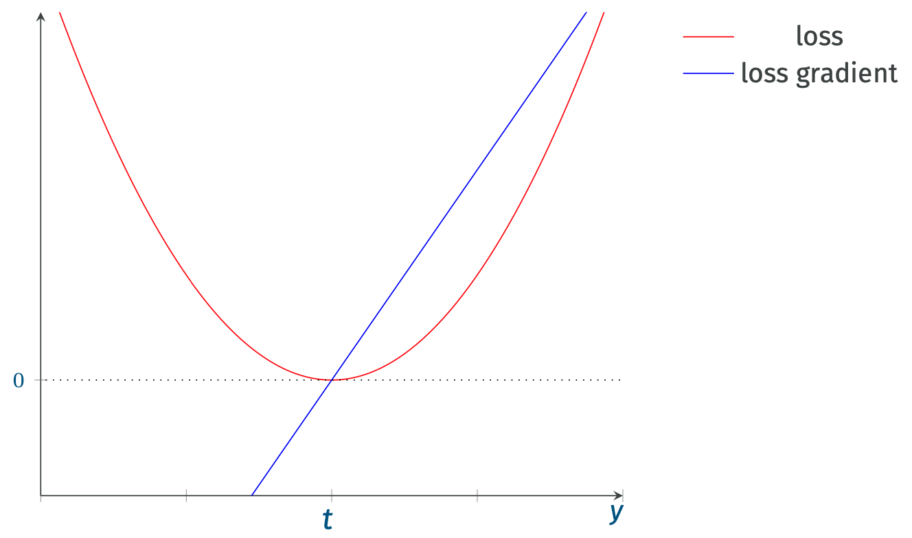
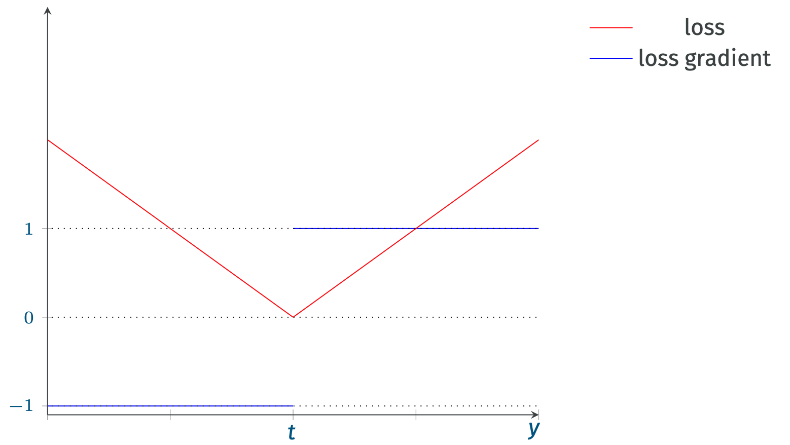
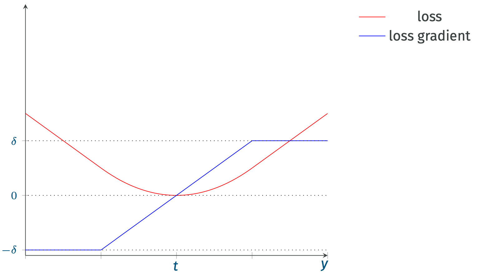
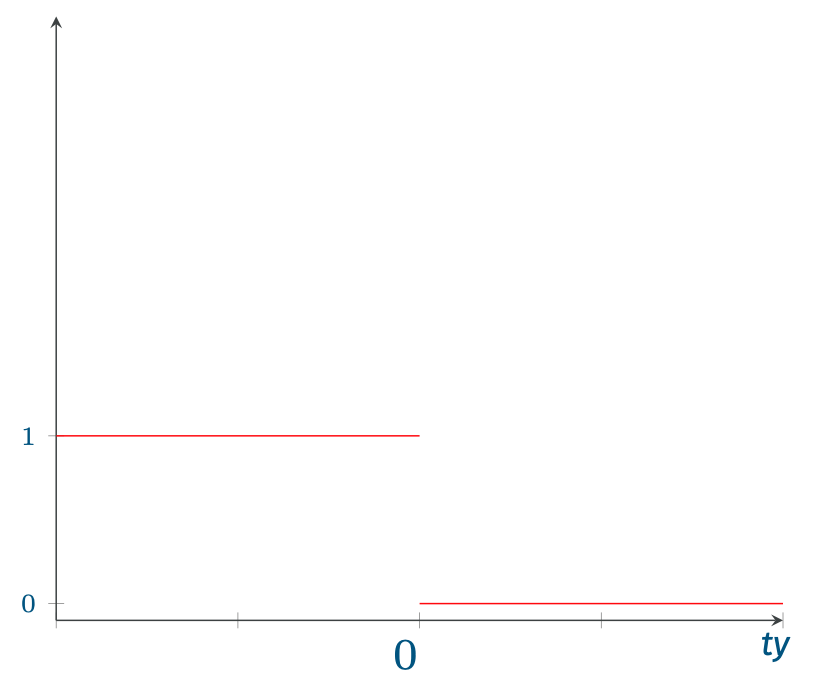
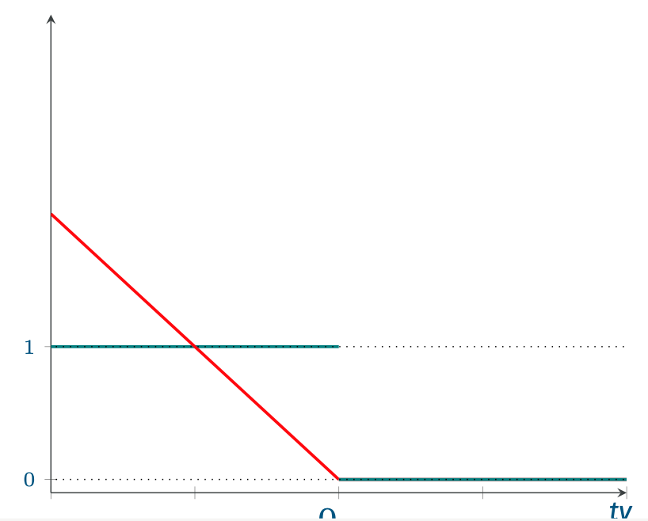
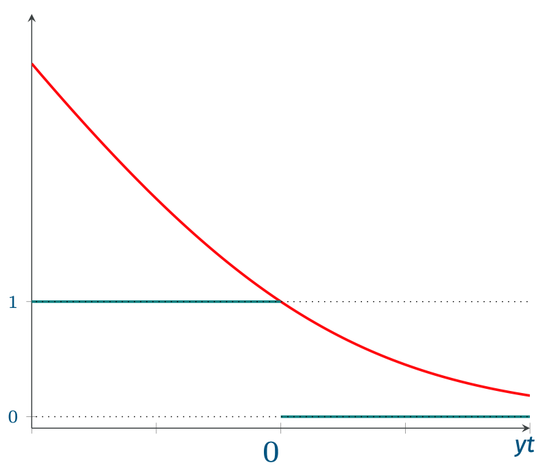

Per semplicità, consideriamo il caso della [[Supervised Learning#^42e3b6|regressione]].
Assumimo quindi che sia $y = h(x)$ che il relatico target $t$ siano *valori reali*.

# Loss per Regressione
## Quadratic Loss
Una comune [[Prediction Risk#^0b44e2|funzione loss]] [[Convessità|convessa]] è la **distanza quadratia**.
$$L(y,t) = (y-t)^2$$

Questa funzione loss è anche nota come **quadratic loss**.

Se applichiamo quindi la *loss quadratica* alla funzione di [[Prediction Risk#^9cd1a0|rischio empirico]] avremo $$\overline{\mathcal{R}}_{\mathcal{T}}(h) = \frac{1}{\vert \mathcal{T} \vert} \sum_{(x,t) \in \mathcal{T}}(h(x)-t)^2$$

Consideriamo per esempio la [[Linear Regression]], ovvero $$h_{\mathbf{w}, w_0}(x) = \mathbf{w}^T\mathbf{x} + w_0 = w_0 + w_1x_1 + w_2x_2 + ... + w_dx_d$$
Abbiamo quindi che i parametri da cui dipende $h$ sono i coefficienti $(w_0, w_1, ..., w_d)$.

La funzione loss sarà quindi $$\mathcal{L}(\mathbf{w}, w_0 \vert \mathcal{T}) = \sum_{(\mathbf{x}, t) \in \mathcal{T}} (\mathbf{w}^T\mathbf{x} + w_0 - t)^2$$

Le **derivate parziali** saranno
$$\begin{align}
\dfrac{\partial}{\partial w_i} \mathcal{L}(\mathbf{w}, w_0 \vert \mathcal{T}) &= \sum_{(\mathbf{x}, t) \in \mathcal{T}} (\mathbf{w}^T\mathbf{x} + w_0 - t)w_i &\forall i = 1, ..., d\\
\dfrac{\partial}{\partial w_0} \mathcal{L}(\mathbf{w}, w_0 \vert \mathcal{T}) &= \sum_{(\mathbf{x}, t) \in \mathcal{T}} (\mathbf{w}^T\mathbf{x} + w_0 - t)
\end{align}$$

## Absolute Loss
La [[#Quadratic Loss]] è facile da gestire matematicamente, purtroppo però **penalizza troppo** i valori che si allontanano dal target $t$ (la penalità cresce in maniera quadratica).

Perciò invece di far crescere la penalità in maniera quadratica, la si può far crescere in maniera **lineare**.
Una funzione di questo tipo è la **absolute loss**.
$$L(y,t) = |y-t|$$

Nel punto $y = t$ la funzione non è derivabile, però per semplicità possiamo porla a 0.
Per $y > t$ la derivata è sempre 1, mentre per $y < t$ la derivata è sempre -1.

## Huber Loss
Un'altra loss è la **Huber loss**, definita come
$$L(y,t) = \begin{cases}
\dfrac{1}{2}(y-t)^2 &\vert y-t \vert \leq \delta\\
\\
\delta \cdot \vert y-t \vert - \dfrac{\delta^2}{2} &\vert y-t \vert > \delta\\
\end{cases}$$

In questa funzione, penaliziamo in maniera quadratica tutti i valori in un intervallo $\pm \delta$ del target $t$, mentre in maniera lineare tutti i valori più distanti.

# Loss per Classificazione
## 0/1 Loss
Supponiamo di essere nel caso della **classificazione binaria**, ovvero dove $t \in \mathcal{Y} \equiv \lbrace -1, 1 \rbrace$.
Mentre le predizioni del modello sono un valore **reale**, $y \in \mathbb{R}$.
Una funzione loss abbastanza naturale è la **0/1 Loss**  $$L(y,t) = \begin{cases}
1 &\text{sign}(y) \neq t\\
0 &\text{sign}(y) = t
\end{cases}$$^213e05

Possiamo anche scriverlo come una **variabile indicatrice** $$\mathbf{1}\left[ \text{sign}(y) \neq t \right] \equiv \mathbf{1}\left[ ty < 0 \right]$$

Purtroppo ci sono alcuni problemi con questa funzione:
1. non è [[Convessità|convessa]].
2. il gradiente è sempre 0, quindi non può essere applicato il [[Gradient Descent]].
3. se consideriamo una famigli di funzioni lineari, con errore $$\overline{\mathcal{R}}_{\mathcal{T}}(h_{\mathbf{w},w_0}) = \sum_{(\mathbf{x}, t) \in \mathcal{T}} \mathbf{1}\left[ (\mathbf{w}^T\mathbf{x} + w_0)t < 0 \right]$$ bisogna trovare i valori dei coefficienti della combinazione lineare che minimizza il numero totale di errori: questo problema è noto essere **NP-Hard**.

Vogliamo quindi una funzione che **approssimi** la [[Some Loss Functions#^213e05|0/1 loss]] e tale che:
1. non sottostimi mai i reali errori 0/1.
2. si possa applicare il gradient descent.

## Perceptron Loss
Questa funzione loss assegna una penalità che cresce in maniera **lineare** per tutti i valori non correttamente classificati.
Invece, quando $\text{sign}(y) = t$ l'errore è 0.

In altri termini $$L(y,t) = \begin{cases}
yt &\text{sign(y)} \neq t\\
0 &\text{sign(y)} = t\\
\end{cases}$$
O in forma compatta $$L(y,t) = \max(0, -yt)$$

Un primo vantaggio è che la derivata non è semrpe nulla, quindi per $\text{sign(y)} \neq t$ il gradient descent può essere applicato.
Purtroppo però non è **strettamente convessa**, quindi per $\text{sign(y)} = t$ ogni punto è un minimo.

## Hinge Loss
Definita come $$L_H(t, y) = \max(0, 1-ty)$$
![[ML/img/ML_03_16.png]]

Simile alla [[#Perceptron Loss]], penalizza alcune predizioni se **deboli** (ovvero per bassi valori di $y$).

## Log Loss (Cross Entropy)
Un funzione loss comune, usata spesso nella [[Logistic Regression]], è la **Log Loss**, nota anche come **Cross Entropy**.

Essa è definita come $$L(y,t) = \frac{1}{\log{2}} \log{(1 + e^{-yt})}$$

### Relazione con Cross Entropy
Siano le distribuzioni $p,q$, definiamo quindi l'**entropia relativa** (o **cross entropy**) di $q$ rispetto a $p$ come
$$- \mathbb{E}_p \left[ \log(q(x)) \right] = - \int p(x) \cdot \log(q(x)) \,dx$$

Nel caso in cui $q = p$ si parla di **entropia**
$$H_p = - \mathbb{E}_p \left[ \log(p(x)) \right] = - \int p(x) \cdot \log(p(x)) \,dx$$

Tali valori sono correlati alla **divergenza di Kullback-Leibler**
$$KL(q \vert p) = - \int p(x) \cdot \log\frac{q(x)}{p(x)} \,dx = - \int p(x) \cdot \log q(x) \,dx + \int p(x) \cdot \log p(x) \,dx = - \mathbb{E}_p \left[ \log(q(x)) \right] - H_p$$

Consideriamo un classificatore che cerca di predire la probabilità di una classe $C_1$ e siano
- $p = p(C_1 \vert x)$
- $y(x)$ la predizione della probabilità $p$.

La **cross entropy** nel nostro modello, dato che è discreto, sarà
$$\begin{align}
CE(\mathcal{T})
&= - \frac{1}{n} \sum_{i=1}^{n} \left[ t_i\log(y(x_i)) +(1-t_i)\log{(1- y(x_i))} \right]\\
&= - \frac{1}{n} \left(\sum_{x \in C_1}^{n} \log(y(x)) +  \sum_{x \in C_0}\log{(1- y(x))} \right)\\
\end{align}$$

Supponiamo ora che il nostro classificatore è un [[Naive Bayes Classifier#Deriving Posterior distribution $p(C_k vert d)$|Logistic Classifier]], ovvero 
$$y(x_i) = \sigma(\mathbf{w}^Tx + w_0) = \frac{1}{1 + e^{-(\mathbf{w}^Tx + w_0)}}$$

Avremo quindi sarà quindi
$$CE(\mathcal{T}) = \frac{1}{n} \left(\sum_{x \in C_1}^{n} 1 + e^{-(\mathbf{w}^Tx + w_0)} +  \sum_{x \in C_0}1 + e^{\mathbf{w}^Tx + w_0} \right)$$

Se trasformiamo i target da $t \in \lbrace 0,1 \rbrace$ a $\overline{t} \in \lbrace -1, 1 \rbrace$ otterremo quindi che
$$CE(\mathcal{T}) = \frac{1}{n} \left(\sum_{(x,t) \in \mathcal{T}}1 + e^{-\overline{t}(\mathbf{w}^Tx + w_0)} \right)$$
ovvero la **log loss**.

## Exponential Loss
Un'altra loss simile è la **exponential loss**
$$L(y,t) = e^{-yt}$$

Questa funzione penalizza gli errori di più rispetto alla [[#Log Loss (Cross Entropy)|Log Loss]].

![[ML/img/ML_03_17.png]]